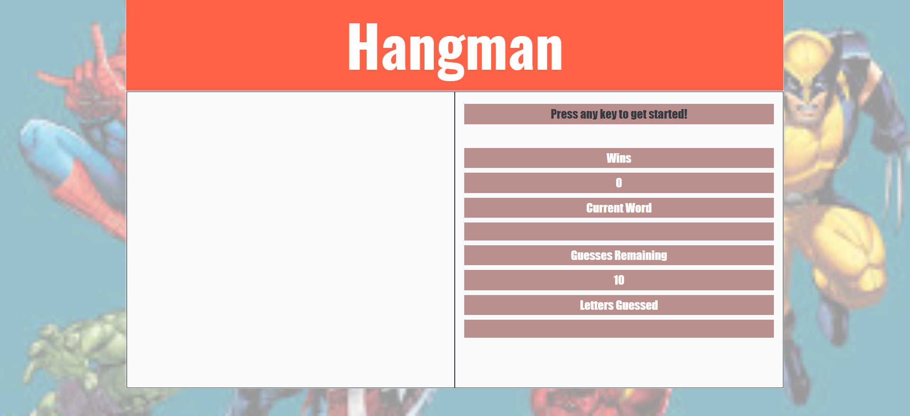

# Word Guess Game
### Homework for Georgia Tech Coding Bootcamp
* This is a simple hangman type word guessing game written using `HTML`,`JavaSccript` and `CSS`
* Theme for this project is Marvel superhero characters, so the words generated by the computer are Marvel super hero names. (Hint: blackpanther, thanos,captainamerica etc.).
* A user gets ten chances to guess the letters.

 

### Live Demo
* [Play the game](https://pshegde123.github.io/Word-Guess-Game/)

### Getting Started
(1) Clone this repository.

(2) Change directory to word-guess-game.

(3) In your browser open index.html.

#### In progress work-items:
1. At the start of the game after first key press event, 'You lose' image is displayed. Its only after second key press event program works.Working on to fix this issue.
